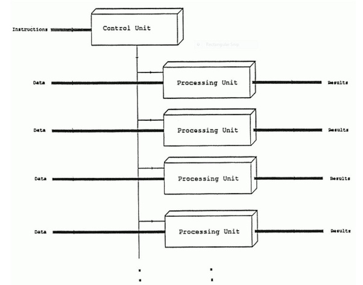

# stm32f4xxx-SIMD-add
This is a demostration of SIMD code in stm32f4xxx microcontroller. This repository was based on my answer on Quora : [Rohan Verma's answer](http://qr.ae/TUT1OT)

Now I’m fan of the **pair-programming** style of coding the solution because it lets you know the efficiency of your counterpart better. So lets devise this solution together, lets start with some information about** SIMD programming **in ARM microcontroller.  
**What is SIMD?**
SIMD stands for Single Instruction stream and Multiple Data stream . The same set of instructions is executed in parallel to different sets of data.  
This reduces the amount of hardware control logic needed by N times for the same amount of calculations, where N is the width of the SIMD unit.  
SIMD computation model is show as follows:  
  
Instruction pipeline is very different concept from SIMD, the instruction pipeline system is accepting multiple instruction which are issued by dispatcher of the CPU, which then afterwards would have to complete the instruction cycle.
Pipelining does not increase the number of instruction *streams* being processed in parallel; the single stream simply flows through a longer channel as it were.  

SIMD is a type of machine which has one hardware instruction pointer and multiple hardware channels to write the data to memory. The SIMD is very different from pipelining where the SIMD is a machine which is executing a single instruction over the multiple data pieces. **So pipelining from the programmer’s perspective can be called SISD.**    

The instruction pipeline is way of bringing the concept of single-core CPU parallelism, so from the programmer's perspective it is SISD while from the hardware perspective it is more like MIMD.  

**ARM Cortex M4 has 3-stage pipeline.**  

Now before diving down inside of the code I want you to look at this CMSIS standard for implementing ARM Cortex M4 instruction set.  

Intrinsic Functions for SIMD Instructions ![only Cortex-M4 and Cortex-M7] (http://arm-software.github.io/CMSIS_5/Core/html/group__intrinsic__SIMD__gr.html)  
Now look at the very simple code:
```
 for(uint32_t  i = 0 ; i < 1024 ; i++){

        A[i] = B[i] + C[i];
    }
 ```

If you compile this code under** arm-gcc-none-eabi cross-compiler**, the instruction pipeline would take care of machine code produced.  
And as per my knowledge, the gcc is always a smart-ass and will automatically do any kind of loop unrolling if required, but given that target is embedded device, so gcc cross-compiler would have no liberty to act like a smart-ass as it were to do normally.   
So optimized version ( loop unrolling) on a** pipelined CPU( without SIMD):**    
```
//Optimization - without SIMD
    for(uint32_t  i = 0 ; i < 1024 ; i = i+4){

        A[i] = B[i] + C[i];
        A[i + 1] = B[i + 1] + C[i + 1];
        A[i + 2] = B[i + 2] + C[i + 2];
        A[i + 3] = B[i + 3] + C[i + 3];

    }
```
The question in above code , **why the loop is unrolled by factor of 4 ?**
Answer is **CPU loves the power of duo or power of 2.**
The SIMD version of the above code uses the instruction __UADD16 (http://arm-software.github.io/CMSIS_5/Core/html/group__intrinsic__SIMD__gr.html#gaa1160f0cf76d6aa292fbad54a1aa6b74) , which performs two 16-bit unsigned integer additions in parallel. Remember that SIMD unit in CPU can’t perform 32-bit unsigned addition, because this is how the SIMD unit in ARM Cortex M4 is designed.
**The SIMD code equivalent on Cortex M4 CPU:**

```
     //Fast SIMD
        uint32_t *B1 = (uint32_t*)B;
        uint32_t *C1 = (uint32_t*)C;
		uint32_t *A31 = (uint32_t*)A3;

       //A3, B, C are respective arrays

		for (uint32_t  i =0 ; i < 1024/2; i++){

                A31[i] = __UQADD16 (B1[i] , C1[i]);


     }
  ```
  
More tips on SIMD : ARM Cortex M4/M7 Advanced Tips 2 - SIMD instruc... (https://community.st.com/videos/1043-arm-cortex-m4m7-advanced-tips-2-simd-instructions)
